# Jarkom-Modul-2-2026-K-22

**Anggota Kelompok**
| Nama                   | NRP        |
| ---------------------- | ---------- |
| Muhamad Sabilil Haq    | 5027251041 |
| M. Faris Roisul Azhar    | 5027251048 |

## Laporan Praktikum
## Glosarium Entitas

- **rootkit**: Router sentral (*gateway*).
- **alpha, beta, gamma**: Klien sayap kiri (*pengamat*).
- **delta, epsilon**: Klien sayap kanan (*eksekutor*).
- **abbey, penny**: Gerbang penyaring (*reverse proxy*).
- **prab**: Penjaga nama utama (*NS*).
- **tedd**: Penjaga nama bayangan (*NS2*).
- **obladi, desmond**: Repositori web statis.
- **oblada, molly**: Repositori web dinamis.
- **`<xxxxx>`**: k22.
- **Aturan resolver awal**: Setiap tokoh (*host*) non-router menambahkan `nameserver 192.168.122.1` saat UI aktif (untuk memudahkan akses dan instalasi paket yang dibutuhkan di awal).
- **Penataan ulang resolver**: Setelah DNS internal hidup (Soal 5), urutkan menjadi `prab → tedd → 192.168.122.1` pada semua non-router.
- **Area vault**: Kelompok *repository* web statis yang terdiri dari node **obladi** dan **desmond**.
- **Area core**: Kelompok *repository* web dinamis yang terdiri dari node **oblada** dan **molly**.
- **Kanonik**: Hostname utama yang menjadi identitas publik layanan. Semua akses lewat IP atau nama lain akan dialihkan secara permanen ke hostname ini (misalnya: `www.<xxxxx>.com`).

## Soal Soal
> 1. Sebagai pusat kesadaran The Mesh, **rootkit** harus merentangkan koneksinya ke lima gerbang utama (Switch). Tetapkan alamat IP dan default gateway untuk seluruh Entitas, mulai dari para operator **(alpha, beta, gamma)**, penjaga directory **(prab, tedd)**, gerbang penyaring **(abbey, penny)**, hingga repository **(obladi, desmond, oblada, molly)** sesuai dengan topologi pembagian switch yang dirancang. **[GUNAKAN PREFIX IP MASING-MASING KELOMPOK]**.

Disini, kami membuat toplogi sesuai dengan requirement soal dan juga prefix IP di masing masing node, menggunakan prefix 192.222.X.X.

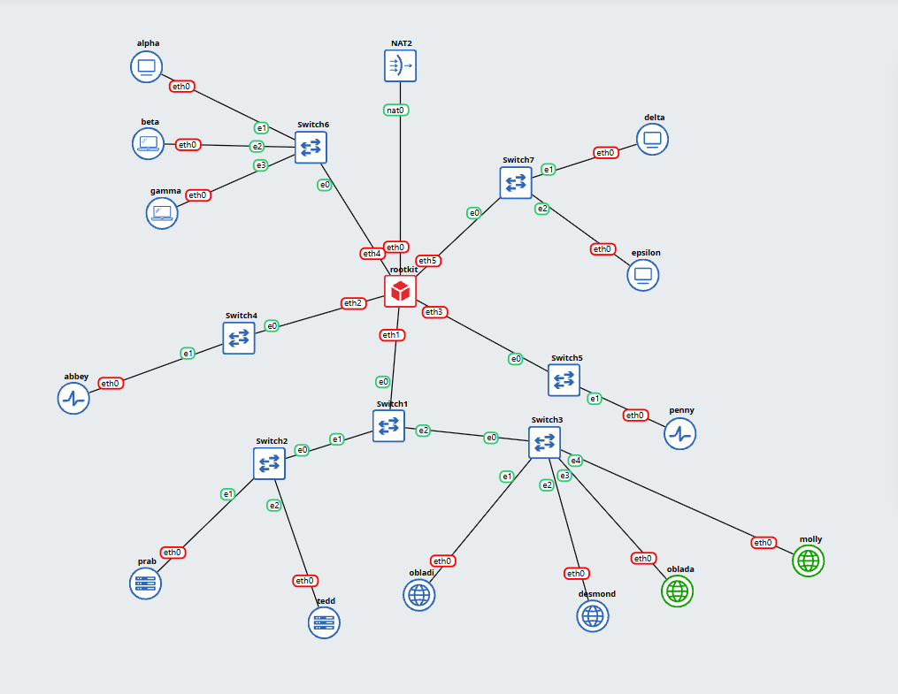

Kemudian, disini ada konfigurasi awal untuk router **(rootkit)** dan juga masing masing entitas. Untuk masing masing entitasnya, disini kami langsung saja menambahkan semua resolver yg dibutuhkan. 
- rootkit **(router)**
```
auto eth0
iface eth0 inet dhcp

auto eth1
iface eth1 inet static
    address 192.222.1.1
    netmask 255.255.255.0

auto eth2
iface eth2 inet static
    address 192.222.2.1
    netmask 255.255.255.0

auto eth3
iface eth3 inet static
    address 192.222.3.1
    netmask 255.255.255.0

auto eth4
iface eth4 inet static
    address 192.222.4.1
    netmask 255.255.255.0

auto eth5
iface eth5 inet static
    address 192.222.5.1
    netmask 255.255.255.0
```
- prab
```
auto eth0
iface eth0 inet static
    address 192.222.1.2
    netmask 255.255.255.0
    gateway 192.222.1.1
    up echo -e "nameserver 192.222.1.2\nnameserver 192.222.1.3\nnameserver 192.168.122.1" > /etc/resolv.conf
```
- tedd
```
auto eth0
iface eth0 inet static
    address 192.222.1.3
    netmask 255.255.255.0
    gateway 192.222.1.1
    up echo -e "nameserver 192.222.1.2\nnameserver 192.222.1.3\nnameserver 192.168.122.1" > /etc/resolv.conf
```
- obladi
```
auto eth0
iface eth0 inet static
    address 192.222.1.4
    netmask 255.255.255.0
    gateway 192.222.1.1
    up echo -e "nameserver 192.222.1.2\nnameserver 192.222.1.3\nnameserver 192.168.122.1" > /etc/resolv.conf
```
- desmond
```
auto eth0
iface eth0 inet static
    address 192.222.1.5
    netmask 255.255.255.0
    gateway 192.222.1.1
    up echo -e "nameserver 192.222.1.2\nnameserver 192.222.1.3\nnameserver 192.168.122.1" > /etc/resolv.conf
```
- oblada
```
auto eth0
iface eth0 inet static
    address 192.222.1.6
    netmask 255.255.255.0
    gateway 192.222.1.1
    up echo -e "nameserver 192.222.1.2\nnameserver 192.222.1.3\nnameserver 192.168.122.1" > /etc/resolv.conf
```
- molly
```
auto eth0
iface eth0 inet static
    address 192.222.1.7
    netmask 255.255.255.0
    gateway 192.222.1.1
    up echo -e "nameserver 192.222.1.2\nnameserver 192.222.1.3\nnameserver 192.168.122.1" > /etc/resolv.conf
```
- abbey
```
auto eth0
iface eth0 inet static
    address 192.222.2.2
    netmask 255.255.255.0
    gateway 192.222.2.1
    up echo -e "nameserver 192.222.1.2\nnameserver 192.222.1.3\nnameserver 192.168.122.1" > /etc/resolv.conf
```
- penny
```
auto eth0
iface eth0 inet static
    address 192.222.3.2
    netmask 255.255.255.0
    gateway 192.222.3.1
    up echo -e "nameserver 192.222.1.2\nnameserver 192.222.1.3\nnameserver 192.168.122.1" > /etc/resolv.conf
```
- alpha
```
auto eth0
iface eth0 inet static
    address 192.222.4.2
    netmask 255.255.255.0
    gateway 192.222.4.1
    up echo -e "nameserver 192.222.1.2\nnameserver 192.222.1.3\nnameserver 192.168.122.1" > /etc/resolv.conf
```
- beta
```
auto eth0
iface eth0 inet static
    address 192.222.4.3
    netmask 255.255.255.0
    gateway 192.222.4.1
    up echo -e "nameserver 192.222.1.2\nnameserver 192.222.1.3\nnameserver 192.168.122.1" > /etc/resolv.conf
```
- gamma
```
auto eth0
iface eth0 inet static
    address 192.222.4.4
    netmask 255.255.255.0
    gateway 192.222.4.1
    up echo -e "nameserver 192.222.1.2\nnameserver 192.222.1.3\nnameserver 192.168.122.1" > /etc/resolv.conf
```
- epsilon
```
auto eth0
iface eth0 inet static
    address 192.222.5.3
    netmask 255.255.255.0
    gateway 192.222.4.1
    up echo -e "nameserver 192.222.1.2\nnameserver 192.222.1.3\nnameserver 192.168.122.1" > /etc/resolv.conf
```
- delta
```
auto eth0
iface eth0 inet static
    address 192.222.5.2
    netmask 255.255.255.0
    gateway 192.222.4.1
    up echo -e "nameserver 192.222.1.2\nnameserver 192.222.1.3\nnameserver 192.168.122.1" > /etc/resolv.conf
```
Testing beberapa:

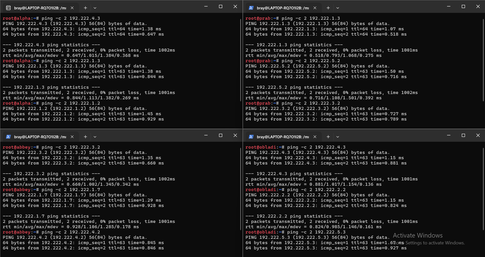

---

> 2. Meskipun The Mesh beroperasi dalam bayang-bayang, Rootkit menyadari bahwa Entitas di dalamnya masih membutuhkan asupan paket dari dunia luar. Buka jalur menuju NAT dengan memastikan antarmuka WAN di router rootkit aktif. Konfigurasikan NAT agar dapat meneruskan lalu lintas keluar bagi seluruh alamat internal, sehingga semua host di dalam jaringan dapat menjangkau internet publik menggunakan IP address.

Agar seluruh host dapat menggunakan internet, ditambahkan konfigurasi pada routernya, sehingga konfigurasi routernya menjadi:
```
auto eth0
iface eth0 inet dhcp
    up iptables -t nat -A POSTROUTING -o eth0 -j MASQUERADE
    up iptables -A FORWARD -i eth1 -o eth0 -j ACCEPT
    up iptables -A FORWARD -i eth2 -o eth0 -j ACCEPT
    up iptables -A FORWARD -i eth3 -o eth0 -j ACCEPT
    up iptables -A FORWARD -i eth4 -o eth0 -j ACCEPT
    up iptables -A FORWARD -i eth5 -o eth0 -j ACCEPT
    up iptables -A FORWARD -i eth0 -m state --state ESTABLISHED,RELATED -j ACCEPT
    up sysctl -w net.ipv4.ip_forward=1

auto eth1
iface eth1 inet static
    address 192.222.1.1
    netmask 255.255.255.0

auto eth2
iface eth2 inet static
    address 192.222.2.1
    netmask 255.255.255.0

auto eth3
iface eth3 inet static
    address 192.222.3.1
    netmask 255.255.255.0

auto eth4
iface eth4 inet static
    address 192.222.4.1
    netmask 255.255.255.0

auto eth5
iface eth5 inet static
    address 192.222.5.1
    netmask 255.255.255.0
```
Testing di beberapa:

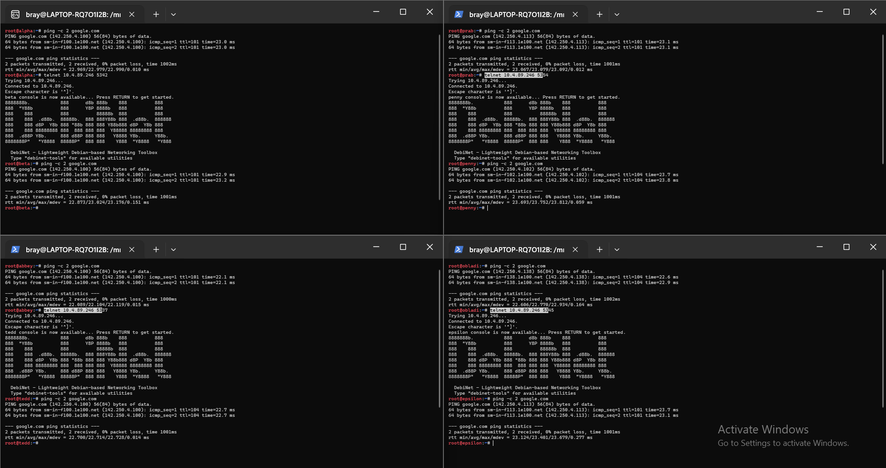

---

> 3. Jaringan rahasia tidak akan berfungsi tanpa sinkronisasi antar divisi. Pastikan seluruh Entitas dapat saling terhubung dan berkomunikasi lintas jalur (routing internal via rootkit berfungsi). Untuk menghindari fragmentasi saat persiapan, pastikan setiap host non-router menambahkan resolver 192.168.122.1 (tambah di file /etc/resolv.conf, kalau sudah pakai resolver itu tidak perlu memasukkan resolver google) saat antarmukanya aktif agar akses untuk mengunduh paket instalasi dari internet tersedia sejak awal beroperasi.

Untuk penambahan resolver di host non-router, kami langsung tambahkan di konfigurasi awal, yaitu di bagian (ini sekaligus menambahkan resolver prab dan tedd juga):
```
up echo -e "nameserver 192.222.1.2\nnameserver 192.222.1.3\nnameserver 192.168.122.1" > /etc/resolv.conf
```

Check /etc/resolv.conf di beberapa host:

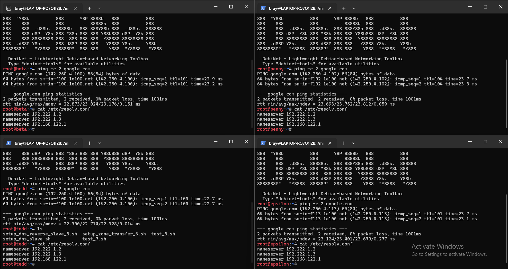

---

> 4. Penjaga Direktori mulai menuliskan hukum The Mesh. Pada node prab, bangun zona k22.com sebagai authoritative dengan SOA yang menunjuk ke prab.k22.com, serta tambahkan catatan NS untuk prab.k22.com dan tedd.k22.com. Buat A record untuk prab.k22.com dan tedd.k22.com yang mengarah ke alamat IP mereka masing-masing, serta A record apex k22.com yang mengarah ke gerbang aplikasi dinamis (penny). Aktifkan fitur notify dan allow-transfer ke tedd, lalu set forwarders ke 192.168.122.1. Di node tedd, tarik zona k22.com dari master dan pastikan server menjawab secara authoritative. Setelah fondasi nama ini berdiri kokoh, perbarui urutan resolver pada seluruh Entitas non-router menjadi: IP prab, IP tedd, lalu 192.168.122.1. Verifikasi bahwa query ke domain apex maupun hostname di dalam zona dijawab dengan benar oleh prab atau tedd.

Disini, kami melakukan konfigurasi DNS menggunakan BIND9 dengan menerapkan Master-Slave. Node Prab berperan sebagai Master DNS, sedangkan node Tedd berperan sebagai Slave DNS yang menerima salinan zona dari Prab. Selain itu, kami juga menggunakan shell script untuk masing masing.

**1. Konfigurasi DNS Master (Prab)**

Alur konfigurasi pada Prab adalah sebagai berikut:

1. **Instalasi BIND9**  
   Script memperbarui daftar paket dan menginstal `bind9`, `bind9-utils`, serta `bind9-dnsutils` sebagai layanan dan alat bantu pengelolaan DNS.

2. **Konfigurasi BIND9**  
   Script mengatur `named.conf.options` untuk mengaktifkan DNS recursion, mengizinkan query, dan menetapkan `192.168.122.1` sebagai *forwarder*.

3. **Pembuatan DNS Zone**  
   Script mengatur `named.conf.local` untuk mendefinisikan `k22.com` sebagai *Master Zone*. Konfigurasi ini juga mengizinkan Tedd (`192.222.1.3`) menerima transfer zona dari Prab.

4. **Pembuatan Zone File**  
   Script membuat *zone file* `k22.com` yang berisi SOA sebagai informasi otoritatif zona, NS sebagai daftar nameserver, serta A record untuk pemetaan domain ke alamat IP.

5. **Validasi dan Menjalankan Layanan**  
   Konfigurasi diperiksa menggunakan `named-checkconf` dan `named-checkzone`. Jika valid, layanan BIND9 dijalankan ulang agar konfigurasi terbaru diterapkan.

6. **Pengujian DNS**  
   Script menjalankan `dig` untuk memeriksa respons DNS dari Prab, termasuk domain `k22.com` dan NS record-nya.

Hasilnya:

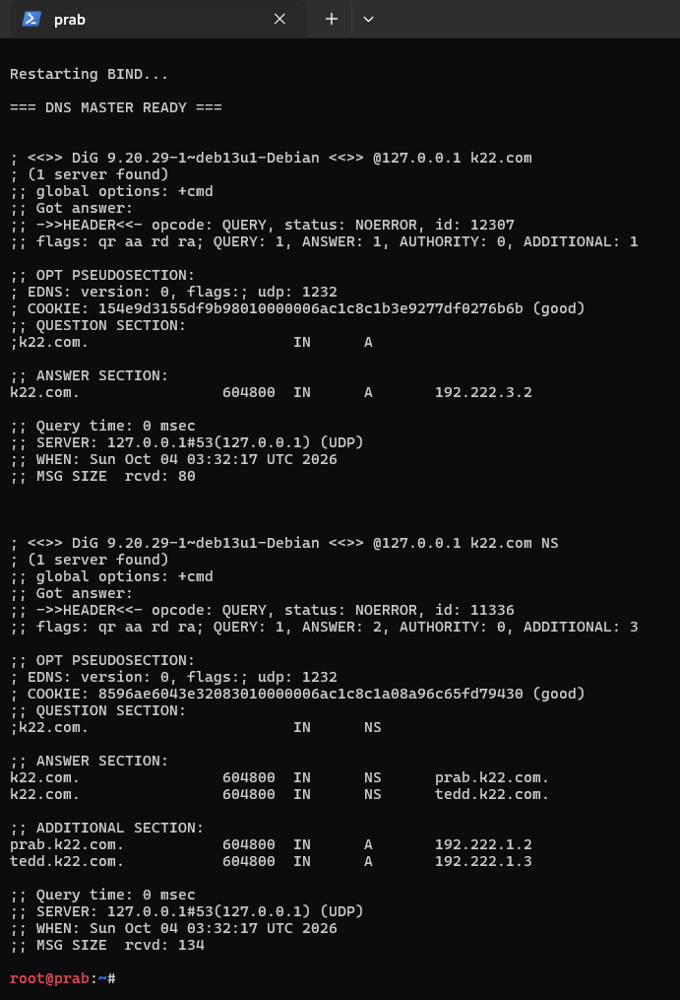

Scriptnya [setup_dns_master.sh](nodes/switch1/switch2/prab/setup_dns_master.sh)
<details>
  <summary>Klik untuk melihat script lengkap</summary>

```
#!/bin/bash

set -e

ZONE="k22.com"
ZONE_DIR="/etc/bind/jarkom"
ZONE_FILE="$ZONE_DIR/$ZONE"

echo "[1/6] Installing BIND9..."
apt update
apt install bind9 bind9-utils bind9-dnsutils -y

echo "[2/6] Preparing zone directory..."
mkdir -p "$ZONE_DIR"

echo "[3/6] Configuring named.conf.options..."
cat > /etc/bind/named.conf.options <<'EOF'
options {
    directory "/var/cache/bind";

    recursion yes;

    allow-query { any; };

    forwarders {
        192.168.122.1;
    };

    dnssec-validation no;

    listen-on { any; };
    listen-on-v6 { any; };
};
EOF

echo "[4/6] Configuring authoritative zone..."
cat > /etc/bind/named.conf.local <<'EOF'
zone "k22.com" {
    type master;
    file "/etc/bind/jarkom/k22.com";

    notify yes;

    also-notify {
        192.222.1.3;
    };

    allow-transfer {
        192.222.1.3;
    };
};
EOF

echo "[5/6] Creating zone file..."
cat > "$ZONE_FILE" <<'EOF'
$TTL    604800

@       IN      SOA     prab.k22.com. root.k22.com. (
                        2026093001
                        604800
                        86400
                        2419200
                        604800
)

@       IN      NS      prab.k22.com.
@       IN      NS      tedd.k22.com.

prab    IN      A       192.222.1.2
tedd    IN      A       192.222.1.3

@       IN      A       192.222.3.2
EOF

echo "[6/6] Checking configuration..."
named-checkconf
named-checkzone "$ZONE" "$ZONE_FILE"

echo
echo "Restarting BIND..."
if [ -x /etc/init.d/bind9 ]; then
    service bind9 restart
else
    pkill named 2>/dev/null || true
    named -c /etc/bind/named.conf
fi

echo
echo "=== DNS MASTER READY ==="
echo
dig @127.0.0.1 "$ZONE"
echo
dig @127.0.0.1 "$ZONE" NS
```

</details>

**2. Konfigurasi DNS Slave (Tedd)**

Alur konfigurasi pada Tedd adalah sebagai berikut:

1. **Instalasi BIND9**  
   Script memperbarui daftar paket dan menginstal BIND9 beserta utilitas pendukung yang diperlukan.

2. **Konfigurasi BIND9**  
   Script mengatur `named.conf.options` dengan konfigurasi dasar yang serupa dengan Prab, termasuk penggunaan DNS forwarder.

3. **Konfigurasi Slave Zone**  
   Pada `named.conf.local`, zona `k22.com` didefinisikan sebagai *Slave Zone* dengan Prab (`192.222.1.2`) sebagai *Master DNS*. File zona hasil transfer disimpan di `/var/cache/bind/k22.com`.

4. **Validasi dan Menjalankan Layanan**  
   Script memeriksa konfigurasi menggunakan `named-checkconf`, kemudian menjalankan ulang proses BIND9 agar konfigurasi diterapkan.

5. **Pemeriksaan Zone Transfer**  
   Setelah layanan berjalan, script menunggu proses transfer zona, lalu memeriksa keberadaan file zona dan menjalankan `dig` untuk memastikan Tedd dapat memberikan respons DNS untuk `k22.com` dan NS record-nya.

Hasilnya:

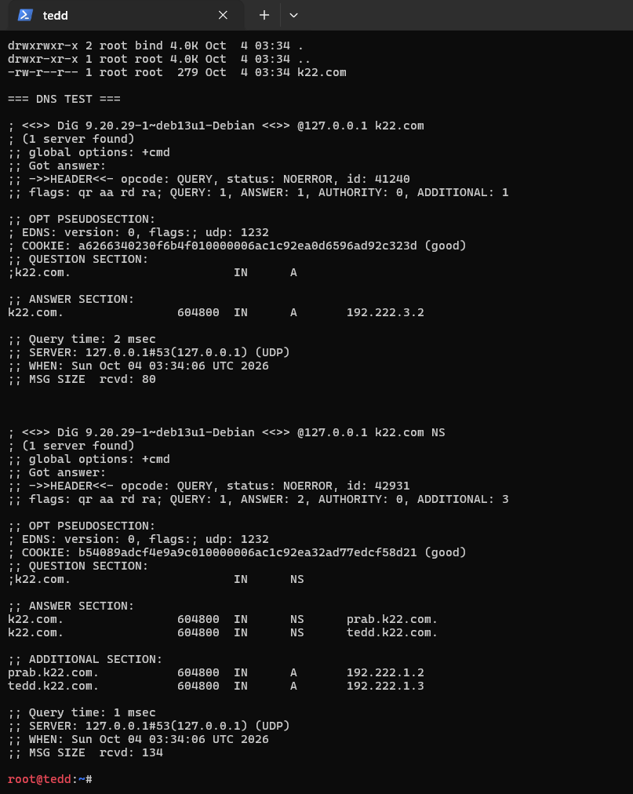

Scriptnya [setup_dns_slave.sh](nodes/switch1/switch2/tedd/setup_dns_slave.sh)
<details>
  <summary>Klik untuk melihat script lengkap</summary>

```
#!/bin/bash

set -e

ZONE="k22.com"

echo "[1/5] Installing BIND9..."
apt update
apt install bind9 bind9-utils bind9-dnsutils -y

echo "[2/5] Configuring named.conf.options..."
cat > /etc/bind/named.conf.options <<'EOF'
options {
    directory "/var/cache/bind";

    recursion yes;

    allow-query { any; };

    forwarders {
        192.168.122.1;
    };

    dnssec-validation no;

    listen-on { any; };
    listen-on-v6 { any; };
};
EOF

echo "[3/5] Configuring slave zone..."
cat > /etc/bind/named.conf.local <<'EOF'
zone "k22.com" {
    type slave;

    masters {
        192.222.1.2;
    };

    file "/var/cache/bind/k22.com";
};
EOF

echo "[4/5] Checking configuration..."
named-checkconf

echo "[5/5] Starting BIND..."
pkill named 2>/dev/null || true
named -c /etc/bind/named.conf

echo
echo "Waiting for zone transfer..."
sleep 2

echo
echo "=== TRANSFERRED ZONE ==="
ls -lah /var/cache/bind/

echo
echo "=== DNS TEST ==="
dig @127.0.0.1 "$ZONE"
echo
dig @127.0.0.1 "$ZONE" NS
```

</details>

---

> 5. "Entitas tanpa identitas adalah anomali," pesan Rootkit. Namai semua Entitas (hostname) sesuai glosarium: rootkit, alpha, beta, gamma, delta, epsilon, prab, tedd, abbey, penny, obladi, desmond, oblada, molly, dan verifikasi bahwa setiap host mengenali hostname tersebut secara system-wide. Buat setiap domain untuk masing-masing node sesuai dengan namanya (contoh: alpha.k22.com) dan assign IP masing-masing juga. Lakukan pengecualian untuk node yang bertanggung jawab atas prab dan tedd.

Disini, kami langsung saja menggunakan shell script. Alur shell scriptnya (dijalankan di Prab) adalah sebagai berikut:

1. **Pemeriksaan Zone File**  
   Script memeriksa keberadaan file zona `k22.com` pada direktori `/etc/bind/jarkom/`. Jika file tidak ditemukan, proses dihentikan untuk mencegah perubahan pada file yang tidak tersedia.

2. **Pembaruan Konfigurasi DNS**  
   Script memperbarui `named.conf.local` dengan mendefinisikan `k22.com` sebagai *Master Zone*. Konfigurasi ini juga mempertahankan fitur `notify` dan mengizinkan Tedd (`192.222.1.3`) menerima transfer zona dari Prab.

3. **Penambahan A Record**  
   Script menghapus blok A record Soal 5 yang mungkin telah ditambahkan sebelumnya agar tidak terjadi duplikasi. Selanjutnya, serial SOA dinaikkan satu angka dan A record untuk setiap Entitas ditambahkan ke dalam *zone file*. Pengecualian diberikan untuk Prab dan Tedd karena A record keduanya telah dibuat pada konfigurasi nomor 4.

4. **Validasi Konfigurasi**  
   Setelah seluruh record ditambahkan, script menjalankan `named-checkconf` untuk memeriksa konfigurasi BIND9 dan `named-checkzone` untuk memastikan struktur zona `k22.com` valid.

5. **Reload Layanan BIND9**  
   Jika konfigurasi valid dan proses `named` sedang berjalan, script mengirimkan sinyal `HUP` untuk memuat ulang konfigurasi DNS tanpa menghentikan proses BIND9.

Hasilnya:

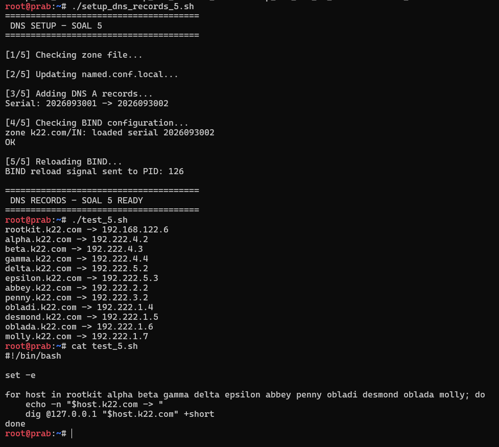

Script lengkap: [setup_dns_records_5.sh](nodes/switch1/switch2/prab/setup_dns_records_5.sh)
<details>
<summary>Klik untuk melihat script lengkap</summary>

```
#!/bin/bash

set -e

ZONE="k22.com"
ZONE_FILE="/etc/bind/jarkom/$ZONE"
NAMED_LOCAL="/etc/bind/named.conf.local"

echo "======================================"
echo " DNS SETUP - SOAL 5"
echo "======================================"

echo
echo "[1/5] Checking zone file..."

if [ ! -f "$ZONE_FILE" ]; then
    echo "ERROR: $ZONE_FILE tidak ditemukan."
    exit 1
fi

echo
echo "[2/5] Updating named.conf.local..."

cat > "$NAMED_LOCAL" <<'EOF'
zone "k22.com" {
    type master;
    file "/etc/bind/jarkom/k22.com";

    notify yes;

    also-notify {
        192.222.1.3;
    };

    allow-transfer {
        192.222.1.3;
    };
};
EOF

echo
echo "[3/5] Adding DNS A records..."

# Hapus blok Soal 5 jika sebelumnya sudah pernah ditambahkan
sed -i '/; === Node A Records - Soal 5 ===/,$d' "$ZONE_FILE"

# Ambil serial sekarang
CURRENT_SERIAL=$(awk '/^[[:space:]]*[0-9]+[[:space:]]*$/ {print $1; exit}' "$ZONE_FILE")

if [ -z "$CURRENT_SERIAL" ]; then
    echo "ERROR: SOA serial tidak ditemukan."
    exit 1
fi

NEW_SERIAL=$((CURRENT_SERIAL + 1))

# Update serial
sed -i "0,/$CURRENT_SERIAL/s//$NEW_SERIAL/" "$ZONE_FILE"

echo "Serial: $CURRENT_SERIAL -> $NEW_SERIAL"

# Tambahkan records
cat >> "$ZONE_FILE" <<'EOF'

; === Node A Records - Soal 5 ===

rootkit IN A 192.168.122.6

alpha   IN A 192.222.4.2
beta    IN A 192.222.4.3
gamma   IN A 192.222.4.4

delta   IN A 192.222.5.2
epsilon IN A 192.222.5.3

abbey   IN A 192.222.2.2
penny   IN A 192.222.3.2

obladi  IN A 192.222.1.4
desmond IN A 192.222.1.5

oblada  IN A 192.222.1.6
molly   IN A 192.222.1.7
EOF

echo
echo "[4/5] Checking BIND configuration..."

named-checkconf
named-checkzone "$ZONE" "$ZONE_FILE"

echo
echo "[5/5] Reloading BIND..."

NAMED_PID=$(pidof named || true)

if [ -n "$NAMED_PID" ]; then
    kill -HUP "$NAMED_PID"
    echo "BIND reload signal sent to PID: $NAMED_PID"
else
    echo "ERROR: named tidak sedang berjalan."
    exit 1
fi

echo
echo "======================================"
echo " DNS RECORDS - SOAL 5 READY"
echo "======================================"
```

</details>

---

> 6. Pastikan zone transfer berjalan, pastikan tedd telah menerima salinan zona terbaru dari prab. Nilai serial SOA di keduanya harus sama karena keduanya tidak bisa dipisahkan dan saling melengkapi

Untuk soal ini, kami langsung saja menjalankan script [setup_zone_transfer_6.sh](nodes/switch1/switch2/tedd/setup_zone_transfer_6.sh) di **tedd**. Alur script:

1. **Validasi Konfigurasi BIND**

   Skrip diawali dengan menjalankan `named-checkconf` untuk memeriksa konfigurasi BIND pada Tedd. Jika ditemukan kesalahan, skrip akan berhenti karena menggunakan `set -e`.

2. **Pemeriksaan SOA Serial Master dan Slave**

   Skrip mengambil nilai SOA Serial dari DNS Master Prab (`192.222.1.2`) dan DNS Slave Tedd (`127.0.0.1`) menggunakan perintah `dig`. Nilai serial dari kedua server kemudian ditampilkan dan dibandingkan untuk memastikan kesesuaian data zona. Jika salah satu serial tidak dapat diperoleh, skrip akan menampilkan pesan error dan menghentikan proses.

3. **Pengecekan dan Pembaruan Zone Transfer**

   Jika SOA Serial Master dan Slave sama, skrip menampilkan pesan `ZONE TRANSFER SUCCESS` dan `SOA SERIAL MATCH`, yang menandakan serial zona telah sinkron.

   Namun, jika kedua serial berbeda, skrip akan mengirimkan sinyal `HUP` ke proses `named` pada Tedd untuk meminta pembaruan zona dari Master. Skrip kemudian menunggu selama tiga detik, mengambil kembali nilai SOA Serial dari kedua server, dan membandingkannya.

   Jika serial sudah sama setelah pembaruan, skrip menampilkan pesan keberhasilan. Jika masih berbeda, skrip menampilkan pesan `ERROR: Zone transfer belum berhasil.` dan menghentikan proses dengan status gagal.

Hasilnya:

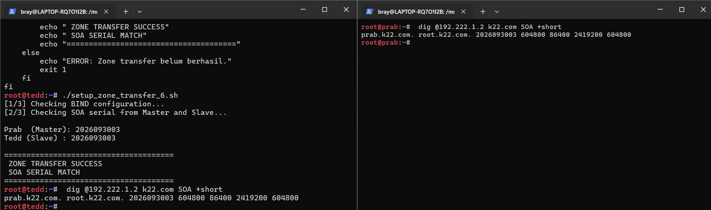

Script lengkap:
<details>
<summary>Klik untuk melihat script lengkap</summary>

```
#!/bin/bash

set -e

ZONE="k22.com"
MASTER="192.222.1.2"

echo "[1/3] Checking BIND configuration..."
named-checkconf

echo "[2/3] Checking SOA serial from Master and Slave..."

MASTER_SERIAL=$(dig @$MASTER "$ZONE" SOA +short | awk '{print $3}')
SLAVE_SERIAL=$(dig @127.0.0.1 "$ZONE" SOA +short | awk '{print $3}')

echo
echo "Prab  (Master): $MASTER_SERIAL"
echo "Tedd (Slave) : $SLAVE_SERIAL"
echo

if [ -z "$MASTER_SERIAL" ] || [ -z "$SLAVE_SERIAL" ]; then
    echo "ERROR: Tidak dapat membaca SOA serial."
    exit 1
fi

if [ "$MASTER_SERIAL" = "$SLAVE_SERIAL" ]; then
    echo "======================================"
    echo " ZONE TRANSFER SUCCESS"
    echo " SOA SERIAL MATCH"
    echo "======================================"
else
    echo "SOA serial berbeda."
    echo "Meminta zone refresh dari Master..."

    kill -HUP $(pidof named)
    sleep 3

    MASTER_SERIAL=$(dig @$MASTER "$ZONE" SOA +short | awk '{print $3}')
    SLAVE_SERIAL=$(dig @127.0.0.1 "$ZONE" SOA +short | awk '{print $3}')

    echo
    echo "Prab  (Master): $MASTER_SERIAL"
    echo "Tedd (Slave) : $SLAVE_SERIAL"
    echo

    if [ "$MASTER_SERIAL" = "$SLAVE_SERIAL" ]; then
        echo "======================================"
        echo " ZONE TRANSFER SUCCESS"
        echo " SOA SERIAL MATCH"
        echo "======================================"
    else
        echo "ERROR: Zone transfer belum berhasil."
        exit 1
    fi
fi
```

</details>

---

> 6. abbey dan penny sebagai gerbang utama, obladi dan desmond sebagai web statis, oblada dan molly sebagai web dinamis. Tambahkan pada zona k22.com A record untuk vault.k22.com (IP obladi & desmond), dan core.k22.com (IP oblada & molly). Tetapkan CNAME: www.k22.com → penny.k22.com dan static.k22.com → abbey.k22.com. Verifikasi dari dua klien berbeda bahwa seluruh hostname tersebut ter-resolve ke tujuan yang benar dan konsisten.

Pada soal ini, dilakukan konfigurasi DNS Record untuk menghubungkan domain `k22.com` dengan layanan web statis dan dinamis. Konfigurasi dilakukan menggunakan shell script pada Prab sebagai DNS Master, kemudian dilakukan pengujian dari Tedd untuk memastikan setiap DNS Record dapat di-resolve dengan benar.

**1. Konfigurasi DNS Record pada Prab**

Alur konfigurasi pada Prab menggunakan script `setup_dns_records_7.sh` adalah sebagai berikut:

1. **Pemeriksaan Zone File**

   Script memeriksa keberadaan file zona `k22.com` pada direktori `/etc/bind/jarkom/`. Jika file tidak ditemukan, script akan menampilkan pesan error dan menghentikan proses.

2. **Pemeriksaan Konfigurasi Zona**

   Script memperbarui `named.conf.local` dengan mendefinisikan `k22.com` sebagai *Master Zone*. Konfigurasi ini juga mengaktifkan fitur `notify` dan mengizinkan Tedd (`192.222.1.3`) menerima *zone transfer* dari Prab.

3. **Pembaruan DNS Record**

   Script menghapus blok DNS Record Soal 7 yang mungkin telah ditambahkan sebelumnya untuk menghindari duplikasi. Selanjutnya, script mengambil nilai SOA Serial saat ini, menaikkannya satu angka, dan memperbarui nilai serial pada file zona.

   Setelah itu, script menambahkan beberapa DNS Record, yaitu:
   - **Vault:** A Record yang mengarah ke Obladi (`192.222.1.4`) dan Desmond (`192.222.1.5`) sebagai repository web statis.
   - **Core:** A Record yang mengarah ke Oblada (`192.222.1.6`) dan Molly (`192.222.1.7`) sebagai repository web dinamis.
   - **www:** CNAME yang mengarah ke `penny.k22.com.`.
   - **static:** CNAME yang mengarah ke `abbey.k22.com.`.

4. **Validasi Konfigurasi DNS**

   Setelah DNS Record ditambahkan, script menjalankan `named-checkconf` untuk memeriksa konfigurasi BIND dan `named-checkzone` untuk memastikan file zona `k22.com` valid.

5. **Reload Layanan BIND**

   Jika konfigurasi berhasil divalidasi dan proses `named` sedang berjalan, script mengirimkan sinyal `HUP` untuk memuat ulang konfigurasi DNS sehingga perubahan DNS Record dapat diterapkan. Jika proses `named` tidak ditemukan, script akan menampilkan pesan error.

Script lengkap [setup_dns_records_7.sh](nodes/switch1/switch2/prab/setup_dns_records_7.sh):
<details>
<summary>Klik untuk melihat script lengkap</summary>

```
#!/bin/bash

set -e

ZONE="k22.com"
ZONE_FILE="/etc/bind/jarkom/$ZONE"
NAMED_LOCAL="/etc/bind/named.conf.local"

echo "======================================"
echo " DNS SETUP - SOAL 7"
echo "======================================"

echo
echo "[1/5] Checking zone file..."

if [ ! -f "$ZONE_FILE" ]; then
    echo "ERROR: Zone file tidak ditemukan:"
    echo "$ZONE_FILE"
    exit 1
fi


echo
echo "[2/5] Ensuring correct zone configuration..."

cat > "$NAMED_LOCAL" <<'CONF'
zone "k22.com" {
    type master;
    file "/etc/bind/jarkom/k22.com";

    notify yes;

    also-notify {
        192.222.1.3;
    };

    allow-transfer {
        192.222.1.3;
    };
};
CONF


echo
echo "[3/5] Updating DNS records..."

# Hapus blok Soal 7 jika sebelumnya sudah pernah dibuat
sed -i '/; === DNS Records - Soal 7 ===/,$d' "$ZONE_FILE"

# Ambil SOA serial
CURRENT_SERIAL=$(awk '/^[[:space:]]*[0-9]+[[:space:]]*$/ {print $1; exit}' "$ZONE_FILE")

if [ -z "$CURRENT_SERIAL" ]; then
    echo "ERROR: SOA serial tidak ditemukan."
    exit 1
fi

NEW_SERIAL=$((CURRENT_SERIAL + 1))

# Update serial
sed -i "0,/$CURRENT_SERIAL/s//$NEW_SERIAL/" "$ZONE_FILE"

echo "Serial: $CURRENT_SERIAL -> $NEW_SERIAL"


cat >> "$ZONE_FILE" <<'RECORDS'

; === DNS Records - Soal 7 ===

; Static Web
vault  IN A 192.222.1.4
vault  IN A 192.222.1.5

; Dynamic Web
core   IN A 192.222.1.6
core   IN A 192.222.1.7

; CNAME
www    IN CNAME penny.k22.com.
static IN CNAME abbey.k22.com.
RECORDS


echo
echo "[4/5] Checking BIND configuration..."

named-checkconf
named-checkzone "$ZONE" "$ZONE_FILE"


echo
echo "[5/5] Reloading BIND..."

NAMED_PID=$(pidof named || true)

if [ -n "$NAMED_PID" ]; then
    kill -HUP "$NAMED_PID"
    echo "BIND reload signal sent to PID: $NAMED_PID"
else
    echo "ERROR: named tidak sedang berjalan."
    exit 1
fi


echo
echo "======================================"
echo " DNS RECORDS - SOAL 7 READY"
echo "======================================"
echo
```

</details>

Untuk pengujiannya disini kami menggunakan script [test_7.sh](nodes/switch1/switch2/tedd/test_7.sh) di **tedd**, hasilnya:

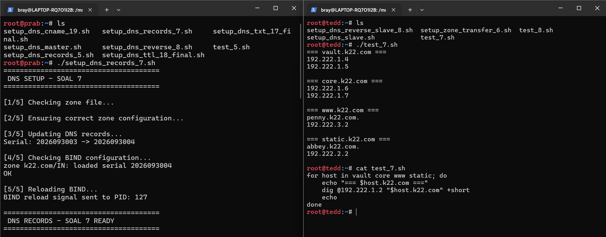

---

> 8. Di prab (master) deklarasikan reverse zone untuk segmen jaringan tempat abbey, penny, area vault, dan area core berada. Di tedd (slave) tarik reverse zone tersebut sebagai slave, isi PTR untuk keempat hostname itu agar pencarian balik IP address mengembalikan hostname yang benar, lalu pastikan query reverse untuk alamat abbey, penny, area vault, dan area core dijawab authoritative.

Pada soal ini, Prab berperan sebagai DNS Master yang menyimpan *reverse zone* untuk jaringan `192.222.0.0/16`, sedangkan Tedd berperan sebagai DNS Slave yang menerima salinan zona dari Prab melalui *zone transfer*. Reverse DNS digunakan untuk memetakan alamat IP kembali menjadi nama domain menggunakan **PTR record**.

### 1. Konfigurasi Reverse DNS Master pada Prab

Konfigurasi dilakukan dengan menjalankan script [setup_dns_reverse_8.sh](nodes/switch1/switch2/prab/setup_dns_reverse_8.sh) pada node **Prab**. Alur script tersebut adalah sebagai berikut:

1. **Pemeriksaan Zone File**

   Script memeriksa keberadaan file zona `/etc/bind/jarkom/db.192.222`. Jika file belum tersedia, script akan membuatnya beserta konfigurasi SOA, NS, dan PTR record. Zona yang digunakan adalah `222.192.in-addr.arpa`, yang merepresentasikan jaringan `192.222.0.0/16`.

2. **Pembuatan PTR Record**

   Pada file zona, ditambahkan PTR record untuk memetakan alamat IP ke hostname masing-masing entitas, yaitu:

   - `192.222.2.2` → `abbey.k22.com`
   - `192.222.3.2` → `penny.k22.com`
   - `192.222.1.4` → `obladi.k22.com`
   - `192.222.1.5` → `desmond.k22.com`
   - `192.222.1.6` → `oblada.k22.com`
   - `192.222.1.7` → `molly.k22.com`

3. **Konfigurasi Reverse Zone**

   Script menambahkan konfigurasi zona `222.192.in-addr.arpa` pada `/etc/bind/named.conf.local` dengan tipe `master`. Konfigurasi juga mengaktifkan `notify` dan mengizinkan Tedd (`192.222.1.3`) menerima *zone transfer* dari Prab.

4. **Validasi Konfigurasi**

   Setelah konfigurasi dibuat, script menjalankan `named-checkzone` untuk memeriksa validitas file zona dan `named-checkconf` untuk memeriksa konfigurasi BIND9.

5. **Reload Layanan BIND9**

   Jika validasi berhasil, script mengirimkan sinyal `HUP` ke proses `named` agar konfigurasi terbaru dimuat, kemudian menampilkan informasi bahwa konfigurasi Reverse DNS pada Prab telah disiapkan.

<details>
<summary>Klik untuk melihat script lengkap</summary>

```
#!/bin/bash

set -e

ZONE="222.192.in-addr.arpa"
ZONE_FILE="/etc/bind/jarkom/db.192.222"
NAMED_LOCAL="/etc/bind/named.conf.local"
TEDD_IP="192.222.1.3"

echo "======================================"
echo " DNS REVERSE SETUP - SOAL 8"
echo " MASTER: PRAB"
echo "======================================"

echo
echo "[1/5] Checking zone file..."

if [ ! -f "$ZONE_FILE" ]; then
    echo "Creating $ZONE_FILE..."

    cat > "$ZONE_FILE" <<'EOF'
$TTL    604800

@       IN      SOA     prab.k22.com. root.k22.com. (
                        2026093008
                        604800
                        86400
                        2419200
                        604800
)

@       IN      NS      prab.k22.com.
@       IN      NS      tedd.k22.com.

2.2     IN      PTR     abbey.k22.com.
2.3     IN      PTR     penny.k22.com.

4.1     IN      PTR     obladi.k22.com.
5.1     IN      PTR     desmond.k22.com.

6.1     IN      PTR     oblada.k22.com.
7.1     IN      PTR     molly.k22.com.
EOF

else
    echo "Zone file already exists."
fi


echo
echo "[2/5] Checking zone configuration..."

if ! grep -q 'zone "222.192.in-addr.arpa"' "$NAMED_LOCAL"; then

    cat >> "$NAMED_LOCAL" <<EOF

zone "222.192.in-addr.arpa" {
    type master;
    file "$ZONE_FILE";

    notify yes;

    also-notify {
        $TEDD_IP;
    };

    allow-transfer {
        $TEDD_IP;
    };
};
EOF

    echo "Reverse zone configuration added."
else
    echo "Reverse zone configuration already exists."
fi


echo
echo "[3/5] Checking zone file..."

named-checkzone "$ZONE" "$ZONE_FILE"


echo
echo "[4/5] Checking BIND configuration..."

named-checkconf


echo
echo "[5/5] Reloading BIND..."

kill -HUP "$(pidof named)"

sleep 2


echo
echo "======================================"
echo " REVERSE DNS - SOAL 8 READY"
echo "======================================"
echo
echo "Zone   : $ZONE"
echo "Master : prab.k22.com."
echo "Slave  : tedd.k22.com."
echo
echo "PTR Records:"
echo "192.222.2.2 -> abbey.k22.com."
echo "192.222.3.2 -> penny.k22.com."
echo "192.222.1.4 -> obladi.k22.com."
echo "192.222.1.5 -> desmond.k22.com."
echo "192.222.1.6 -> oblada.k22.com."
echo "192.222.1.7 -> molly.k22.com."
echo
```

</details>

### 2. Konfigurasi Reverse DNS Slave pada Tedd

Setelah Reverse DNS Master dikonfigurasi pada Prab, script [setup_dns_reverse_slave_8.sh](nodes/switch1/switch2/tedd/setup_dns_reverse_slave_8.sh) dijalankan pada node **Tedd**. Alur script tersebut adalah sebagai berikut:

1. **Konfigurasi Slave Zone**

   Script memeriksa apakah zona `222.192.in-addr.arpa` sudah tercantum pada `/etc/bind/named.conf.local`. Jika belum, script menambahkan konfigurasi dengan tipe `slave`, menggunakan Prab (`192.222.1.2`) sebagai Master DNS. File hasil transfer zona akan disimpan di `/var/cache/bind/db.192.222`.

2. **Validasi Konfigurasi**

   Script menjalankan `named-checkconf` untuk memastikan konfigurasi BIND9 pada Tedd valid sebelum layanan dimuat ulang.

3. **Reload Layanan BIND9**

   Script mengirimkan sinyal `HUP` ke proses `named` pada Tedd, kemudian menunggu selama tiga detik agar proses penerimaan zona dapat berlangsung.

4. **Pemeriksaan Zone Transfer**

   Script menjalankan perintah `dig` untuk mengambil SOA record dari DNS lokal Tedd. Nilai serial SOA diperiksa untuk memastikan Tedd telah menerima zona dari Master. Jika serial tidak dapat diperoleh, script menampilkan pesan bahwa Reverse Zone belum diterima. Jika berhasil, script menampilkan serial yang diterima oleh Tedd.

<details>
<summary>Klik untuk melihat script lengkap</summary>

```
#!/bin/bash

set -e

ZONE="222.192.in-addr.arpa"
MASTER_IP="192.222.1.2"
SLAVE_DIR="/var/cache/bind"
SLAVE_FILE="$SLAVE_DIR/db.192.222"
NAMED_LOCAL="/etc/bind/named.conf.local"

echo "======================================"
echo " DNS REVERSE SLAVE - SOAL 8"
echo " SLAVE: TEDD"
echo "======================================"

echo
echo "[1/4] Checking slave zone configuration..."

if ! grep -q 'zone "222.192.in-addr.arpa"' "$NAMED_LOCAL"; then

    cat >> "$NAMED_LOCAL" <<EOF

zone "222.192.in-addr.arpa" {
    type slave;
    masters {
        $MASTER_IP;
    };
    file "$SLAVE_FILE";
};
EOF

    echo "Slave reverse zone configuration added."

else
    echo "Slave reverse zone configuration already exists."
fi


echo
echo "[2/4] Checking BIND configuration..."

named-checkconf


echo
echo "[3/4] Reloading BIND..."

kill -HUP "$(pidof named)"

sleep 3


echo
echo "[4/4] Checking zone transfer..."

SERIAL=$(dig @127.0.0.1 "$ZONE" SOA +short | awk '{print $3}')

if [ -z "$SERIAL" ]; then
    echo "ERROR: Reverse zone belum diterima dari master."
    exit 1
fi

echo "Slave serial: $SERIAL"


echo
echo "======================================"
echo " REVERSE DNS SLAVE - READY"
echo "======================================"
echo
echo "Zone   : $ZONE"
echo "Master : $MASTER_IP"
echo "Slave  : tedd"
echo "Serial : $SERIAL"
echo
```

</details>

Testing:

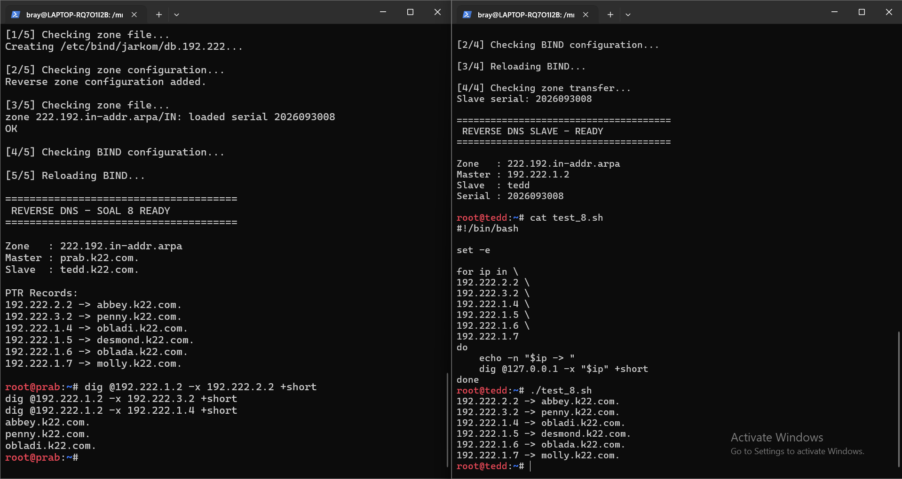

---

> 9. Jalankan layanan web statis pada hostname di node area vault (menggunakan apache). Buka folder direktori /arsip/ dan aktifkan fitur autoindex (directory listing) pada konfigurasi Apache sehingga seluruh daftar file di dalamnya dapat ditelusuri langsung dari browser. Akses pengujian harus dilakukan melalui hostname, bukan IP address.

Pada soal ini, dilakukan konfigurasi **Web Server Statis** pada node **Obladi** dan **Desmond** yang tergabung dalam area *vault*. Kedua node dikonfigurasi menggunakan Apache2 untuk menyediakan halaman arsip statis yang dapat diakses melalui direktori `/arsip/`. Konfigurasi dilakukan dengan menjalankan script `setup_web_static_9.sh` pada masing-masing node, kemudian dilanjutkan dengan pengujian melalui browser.

### 1. Konfigurasi Web Server Statis pada Obladi dan Desmond

Script [setup_web_static_9.sh](nodes/switch1/switch3/obladi/setup_web_static_9.sh) dijalankan pada node **Obladi** dan **Desmond**. Script ini melakukan beberapa tahapan konfigurasi sebagai berikut:

1. **Instalasi Apache2**

   Script memperbarui daftar paket menggunakan `apt-get update`, kemudian menginstal Apache2 sebagai layanan web server yang akan digunakan untuk menyajikan konten statis.

2. **Pembuatan Direktori Arsip**

   Script membuat direktori `/var/www/html/arsip` sebagai lokasi penyimpanan konten web statis. Direktori ini menjadi path yang dapat diakses melalui URL `/arsip/`.

3. **Pembuatan File Statis**

   Script membuat tiga file teks di dalam direktori `/var/www/html/arsip`, yaitu:
   - `index.txt`, berisi informasi arsip, hostname server, layanan yang digunakan, dan direktori.
   - `dokumen.txt`, berisi keterangan dokumen arsip beserta hostname server.
   - `info.txt`, berisi informasi bahwa server merupakan Web Server Statis untuk Soal 9.

   Informasi hostname dihasilkan secara otomatis menggunakan perintah `hostname`, sehingga konten dapat membedakan server Obladi dan Desmond.

4. **Mengaktifkan Directory Listing**

   Script membuat konfigurasi `arsip-autoindex.conf` pada `/etc/apache2/conf-available/`. Konfigurasi tersebut mengaktifkan opsi `Indexes` untuk direktori `/var/www/html/arsip` dan memberikan izin akses melalui `Require all granted`. Selanjutnya, konfigurasi diaktifkan menggunakan `a2enconf arsip-autoindex`, sehingga Apache dapat menampilkan daftar file dalam direktori tersebut ketika direktori diakses melalui browser.

5. **Validasi dan Menjalankan Apache2**

   Script menjalankan `apachectl configtest` untuk memeriksa validitas konfigurasi Apache. Jika proses Apache2 sudah berjalan, layanan akan di-restart menggunakan `apachectl -k restart`. Jika belum berjalan, Apache akan dijalankan menggunakan `apachectl -k start`.

   Setelah itu, script menampilkan hostname, direktori arsip, proses Apache, daftar file pada direktori, serta melakukan pengujian HTTP lokal menggunakan `curl -I`.

Script lengkap:
<details>
<summary>Klik untuk melihat script lengkap</summary>

```
#!/bin/bash

set -e

echo "======================================"
echo " WEB STATIC - SOAL 9"
echo "======================================"

echo "[1/5] Installing Apache..."
apt-get update
apt-get install -y apache2

echo "[2/5] Creating /arsip/ directory..."
mkdir -p /var/www/html/arsip

echo "[3/5] Creating sample files..."

cat > /var/www/html/arsip/index.txt <<EOF
ARSIP WEB STATIC
Hostname: $(hostname)
Server: Apache
Directory: /arsip/
EOF

cat > /var/www/html/arsip/dokumen.txt <<EOF
Dokumen arsip pada $(hostname)
EOF

cat > /var/www/html/arsip/info.txt <<EOF
Static web server - Soal 9
EOF

echo "[4/5] Enabling Apache autoindex..."

cat > /etc/apache2/conf-available/arsip-autoindex.conf <<'EOF'
<Directory /var/www/html/arsip>
    Options +Indexes
    AllowOverride None
    Require all granted
</Directory>
EOF

a2enconf arsip-autoindex >/dev/null

echo "[5/5] Checking and starting Apache..."

apachectl configtest

if pgrep -x apache2 >/dev/null; then
    echo "Apache sedang berjalan, melakukan restart..."
    apachectl -k restart
else
    echo "Apache belum berjalan, melakukan start..."
    apachectl -k start
fi

echo
echo "======================================"
echo " WEB STATIC - SOAL 9 READY"
echo "======================================"
echo
echo "Hostname : $(hostname)"
echo "Directory: /arsip/"
echo
echo "URL:"
echo "  http://$(hostname)/arsip/"
echo
echo "Apache process:"
pgrep -a apache2 || true
echo
echo "Directory listing:"
ls -lah /var/www/html/arsip
echo
echo "HTTP test:"
curl -I "http://127.0.0.1/arsip/"
echo
```

</details>

Testing di **obladi** menggunakan curl dan di **desmond** menggunakan lynx

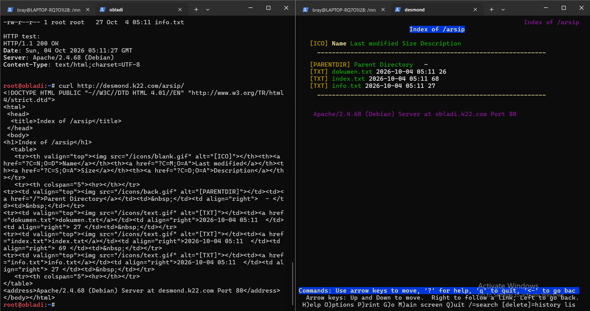

---

> 10. Jalankan layanan web dinamis (PHP-FPM) pada hostname di node core (menggunakan nginx). Buat sebuah aplikasi sederhana yang memuat halaman beranda dan halaman profil. Terapkan aturan rewrite pada server sehingga akses ke /profil dapat berfungsi dengan URL bersih (tanpa akhiran .php). Akses pengujian wajib dilakukan melalui hostname.

Pada soal ini, dilakukan konfigurasi **Web Server Dinamis** pada node **Oblada** dan **Molly** yang tergabung dalam area *core*. Kedua node dikonfigurasi menggunakan **Nginx** sebagai web server dan **PHP-FPM** untuk memproses halaman PHP. Aplikasi web yang dibuat menyediakan halaman beranda dan halaman profil yang dapat diakses melalui hostname `core.k22.com`, termasuk menggunakan URL bersih `/profil` tanpa akhiran `.php`.

Konfigurasi dilakukan dengan menjalankan script [setup_web_dynamic_10_final.sh](nodes/switch1/switch3/oblada/setup_web_dynamic_10_final.sh) pada node **Oblada** dan **Molly**. Script yang disediakan melakukan beberapa tahapan berikut:

1. **Instalasi Nginx dan PHP-FPM**

   Script memperbarui daftar paket menggunakan `apt-get update`, kemudian menginstal Nginx, `php8.4-fpm`, dan `php-cli`. Nginx digunakan untuk menerima dan melayani permintaan HTTP, sedangkan PHP-FPM bertugas memproses kode PHP pada aplikasi web.

2. **Menjalankan PHP-FPM**

   Script memeriksa keberadaan binary PHP-FPM pada `/usr/sbin/php-fpm8.4`. Jika proses PHP-FPM belum berjalan, layanan akan dijalankan dalam mode *daemon*. Selanjutnya, script mencari socket PHP-FPM pada direktori `/run/php/` yang nantinya digunakan Nginx untuk meneruskan permintaan pemrosesan PHP.

3. **Pembuatan Aplikasi Web Dinamis**

   Script membuat direktori `/var/www/core` sebagai *web root* aplikasi. Di dalamnya, dibuat dua file PHP, yaitu:

   - `index.php`, sebagai halaman beranda yang menampilkan judul **Core Dynamic Web**, hostname server, informasi layanan Nginx + PHP-FPM, serta tautan menuju halaman profil.
   - `profil.php`, sebagai halaman profil yang menampilkan informasi profil dari `core.k22.com`, hostname server, serta tautan untuk kembali ke halaman beranda.

   Kedua halaman menggunakan fungsi `gethostname()` untuk menampilkan hostname dari server yang sedang melayani permintaan.

4. **Konfigurasi Nginx**

   Script menghapus konfigurasi lama yang terkait dengan layanan `core`, kemudian membuat konfigurasi baru pada `/etc/nginx/sites-available/core.k22.com` dan mengaktifkannya melalui symbolic link di `/etc/nginx/sites-enabled/`.

   Konfigurasi tersebut menetapkan `core.k22.com` sebagai `server_name`, menggunakan `/var/www/core` sebagai *document root*, serta mengatur `index.php` sebagai halaman indeks utama. Selain itu, konfigurasi `try_files` digunakan untuk menangani permintaan halaman beranda, sedangkan aturan `rewrite` pada path `/profil` mengarahkannya ke `profil.php` sehingga pengguna dapat mengakses halaman profil tanpa menuliskan ekstensi `.php`.

   Untuk memproses file PHP, Nginx menggunakan konfigurasi FastCGI dan meneruskan permintaan ke socket PHP-FPM yang telah ditemukan sebelumnya.

5. **Validasi dan Menjalankan Nginx**

   Setelah konfigurasi selesai, script menjalankan `nginx -t` untuk memeriksa validitas konfigurasi Nginx. Jika proses Nginx sudah berjalan, konfigurasi dimuat ulang menggunakan `nginx -s reload`. Jika belum berjalan, Nginx dijalankan.

   Pada bagian akhir, script menampilkan hostname, domain, direktori aplikasi, lokasi binary dan socket PHP-FPM, serta proses Nginx dan PHP-FPM yang berjalan.

Script lengkap:
<details>
<summary>Klik untuk melihat script lengkap</summary>

```
#!/bin/bash

set -e

DOMAIN="core.k22.com"
WEBROOT="/var/www/core"

echo "======================================"
echo " WEB DYNAMIC - SOAL 10 FINAL"
echo "======================================"
echo
echo "Node     : $(hostname)"
echo "Domain   : $DOMAIN"
echo

# ============================================================
# 1. INSTALL PACKAGE
# ============================================================

echo "[1/8] Installing Nginx + PHP-FPM..."

apt-get update
apt-get install -y nginx php8.4-fpm php-cli

# ============================================================
# 2. START PHP-FPM
# ============================================================

echo
echo "[2/8] Starting PHP-FPM..."

PHP_FPM_BIN="/usr/sbin/php-fpm8.4"

if [ ! -x "$PHP_FPM_BIN" ]; then
    echo "ERROR: $PHP_FPM_BIN tidak ditemukan."
    echo
    dpkg -L php8.4-fpm | grep '/usr/sbin/' || true
    exit 1
fi

if ! pgrep -x "php-fpm8.4" >/dev/null 2>&1; then
    "$PHP_FPM_BIN" -D
fi

sleep 1

echo
echo "PHP-FPM process:"
pgrep -a "php-fpm8.4" || true

# ============================================================
# 3. DETECT SOCKET
# ============================================================

echo
echo "[3/8] Detecting PHP-FPM socket..."

PHP_SOCKET=$(find /run/php \
    -maxdepth 1 \
    -type s \
    -name 'php*-fpm.sock' \
    | head -n 1)

if [ -z "$PHP_SOCKET" ]; then
    echo "ERROR: PHP-FPM socket tidak ditemukan."
    echo
    echo "Isi /run/php:"
    ls -lah /run/php/ || true
    exit 1
fi

echo "PHP-FPM socket:"
echo "  $PHP_SOCKET"

# ============================================================
# 4. CREATE WEB APPLICATION
# ============================================================

echo
echo "[4/8] Creating PHP application..."

mkdir -p "$WEBROOT"

cat > "$WEBROOT/index.php" <<'EOF'
<?php
?>
<!DOCTYPE html>
<html>
<head>
    <meta charset="UTF-8">
    <title>Core Web</title>
</head>
<body>

<h1>Core Dynamic Web</h1>

<p>Hostname: <?php echo gethostname(); ?></p>

<p>Server: Nginx + PHP-FPM</p>

<p>
    <a href="/profil">Lihat Profil</a>
</p>

</body>
</html>
EOF

cat > "$WEBROOT/profil.php" <<'EOF'
<?php
?>
<!DOCTYPE html>
<html>
<head>
    <meta charset="UTF-8">
    <title>Profil - Core Web</title>
</head>
<body>

<h1>Halaman Profil</h1>

<p>Ini adalah halaman profil dari core.k22.com.</p>

<p>Hostname: <?php echo gethostname(); ?></p>

<p>
    <a href="/">Kembali ke Beranda</a>
</p>

</body>
</html>
EOF

# ============================================================
# 5. CLEAN OLD NGINX CONFIG
# ============================================================

echo
echo "[5/8] Cleaning old Nginx configuration..."

# Hapus konfigurasi lama yang kita buat sebelumnya
rm -f /etc/nginx/sites-enabled/core
rm -f /etc/nginx/sites-enabled/core.k22.com

rm -f /etc/nginx/sites-available/core
rm -f /etc/nginx/sites-available/core.k22.com

# Pastikan default tidak mengambil alih
rm -f /etc/nginx/sites-enabled/default

# ============================================================
# 6. CREATE NGINX CONFIG
# ============================================================

echo
echo "[6/8] Configuring Nginx..."

cat > /etc/nginx/sites-available/core.k22.com <<EOF
server {
    listen 80;
    server_name $DOMAIN;

    root $WEBROOT;
    index index.php index.html;

    # Homepage
    location / {
        try_files \$uri \$uri/ /index.php?\$query_string;
    }

    # Clean URL:
    # /profil -> /profil.php
    location = /profil {
        rewrite ^/profil\$ /profil.php last;
    }

    # PHP-FPM
    location ~ \.php\$ {
        include snippets/fastcgi-php.conf;
        fastcgi_pass unix:$PHP_SOCKET;
    }
}
EOF

ln -sf \
    /etc/nginx/sites-available/core.k22.com \
    /etc/nginx/sites-enabled/core.k22.com

# ============================================================
# 7. TEST & START NGINX
# ============================================================

echo
echo "[7/8] Testing Nginx configuration..."

nginx -t

echo
echo "[8/8] Starting / reloading Nginx..."

if pgrep -x nginx >/dev/null 2>&1; then
    nginx -s reload
else
    nginx
fi

sleep 1

# ============================================================
# DONE
# ============================================================

echo
echo "======================================"
echo " WEB DYNAMIC - SOAL 10 READY"
echo "======================================"
echo
echo "Node:"
echo "  $(hostname)"
echo
echo "Domain:"
echo "  $DOMAIN"
echo
echo "Webroot:"
echo "  $WEBROOT"
echo
echo "PHP-FPM:"
echo "  $PHP_FPM_BIN"
echo
echo "Socket:"
echo "  $PHP_SOCKET"
echo
echo "Nginx:"
pgrep -a nginx || true
echo
echo "PHP-FPM:"
pgrep -a php-fpm8.4 || true
echo
echo "======================================"
echo " TEST"
echo "======================================"
echo
echo "curl http://core.k22.com/"
echo "curl http://core.k22.com/profil"
echo
```

</details>

Testing di oblada menggunakan lynx: `lynx http://core.k22.com/profil` dan di molly menggunakan curl: `curl http://core.k22.com/profil`

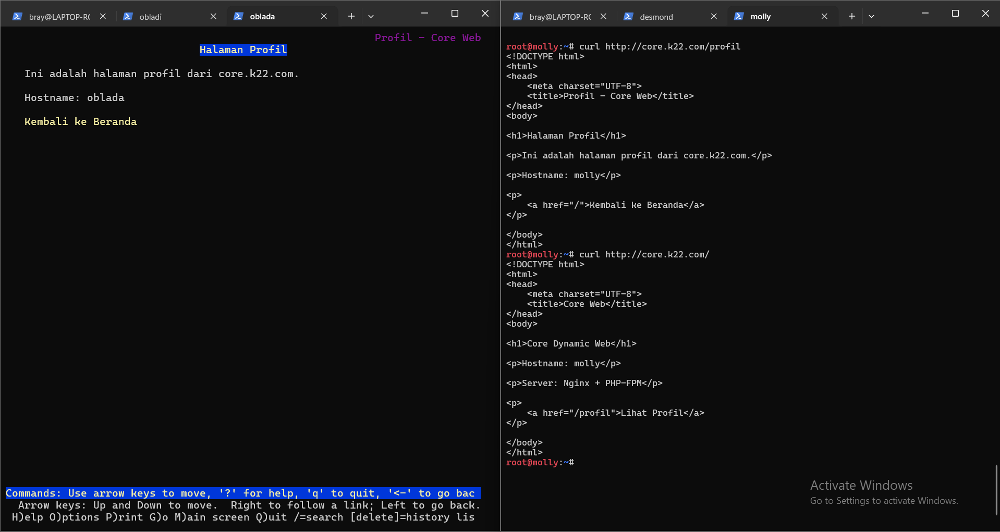

---
